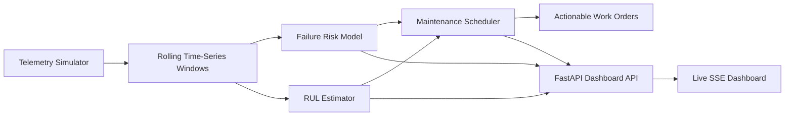

# Predictive Maintenance System

Standalone full-stack predictive maintenance simulator that generates multi-asset machine telemetry, runs time-series failure forecasting, estimates remaining useful life, and builds optimized maintenance schedules with quantified downtime savings.

## What It Demonstrates

- Simulated industrial machine data across vibration, temperature, power, pressure, load, throughput, and lubrication signals
- Time-series feature extraction with rolling trends, anomaly scoring, degradation indexing, and remaining-useful-life estimation
- Failure prediction models for 24-hour and 7-day risk horizons
- Maintenance scheduling logic that prioritizes urgent work orders within crew-capacity constraints
- Live browser dashboard with scenario injection, asset-level health cards, trend charts, and actionable maintenance recommendations

## Architecture



## Project Layout

```text
predictive-maintenance-system/
├── pyproject.toml
├── README.md
├── src/predictive_maintenance_system/
│   ├── analytics.py
│   ├── api.py
│   ├── config.py
│   ├── hub.py
│   ├── models.py
│   ├── scheduler.py
│   ├── simulation.py
│   └── static/
│       ├── app.js
│       ├── index.html
│       └── styles.css
└── tests/
```

## Model Design

The system uses a lightweight ensemble rather than a single opaque score:

1. A degradation model converts rolling sensor windows into normalized wear indicators.
2. A short-horizon hazard model estimates failure probability over the next 24 hours.
3. A medium-horizon risk model estimates cumulative failure probability over the next 7 days.
4. An RUL estimator converts degradation velocity and hazard into remaining useful life.
5. A maintenance scheduler ranks assets by risk, health, criticality, and crew capacity to assign optimized work windows.

The simulator also classifies likely failure modes such as bearing wear, lubrication loss, alignment drift, and pressure leakage based on signal patterns.

## Local Run

### Install

```bash
python3 -m pip install -e .
```

### Start the app

```bash
predictive-maintenance-system
```

Open [http://127.0.0.1:8010](http://127.0.0.1:8010).

## Useful Endpoints

- `GET /api/health`
- `GET /api/dashboard`
- `GET /api/assets`
- `GET /api/maintenance/schedule`
- `GET /api/scenarios`
- `GET /api/events`
- `POST /api/scenarios/{scenario_id}`
- `POST /api/maintenance/execute/{asset_id}`

## Example Scenarios

- `overload-shift`: raises production load and accelerates fleet-wide wear
- `lubrication-loss`: rapidly degrades rotating assets and drives bearing-related risk
- `cooling-loop-drop`: increases temperature-driven risk on thermally sensitive equipment

## Tests

```bash
PYTHONPATH=src python3 -m unittest discover -s tests -t .
```

## Portfolio Talking Points

- Designed a predictive maintenance workflow that turns simulated machine telemetry into failure forecasts and scheduled interventions.
- Combined time-series trend analysis with interpretable risk drivers instead of presenting a black-box score alone.
- Quantified maintenance impact with estimated downtime avoided and cost protected.
- Built a live web interface that lets operators stress the system with scenarios and trigger recommended maintenance actions.
